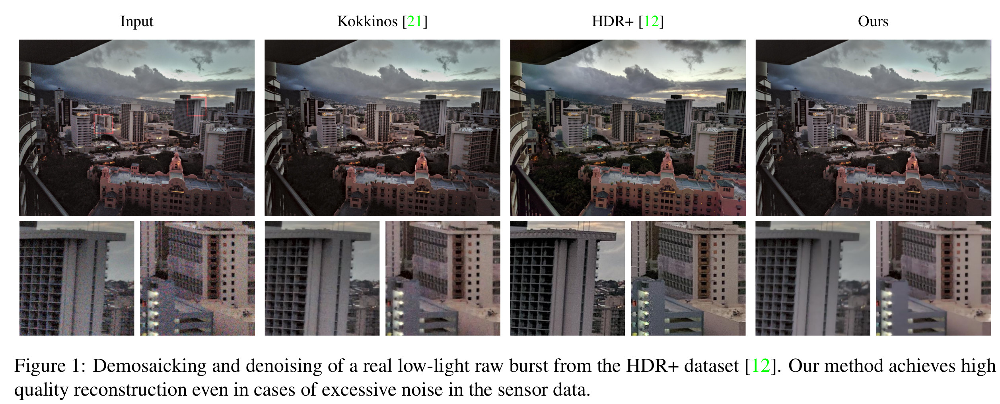

### <center> <a href="https://fkokkinos.github.io/">Filippos Kokkinos</a> &emsp; <a href="https://faculty.skoltech.ru/people/stamatioslefkimmiatis ">Stamatis Lefkimmiatis</a> </center>
####  <center> <a href="http://cig.skoltech.ru">SKOLTECH CIG</a> </center>

### Abstract
Modern inexpensive imaging sensors suffer from inherent hardware constraints which often result in captured images of poor quality. Among the most common ways to deal with such limitations is to rely on burst photography, which nowadays acts as the backbone of all modern smartphone imaging applications. In this work, we focus on the fact that every frame of a burst sequence can be accurately described by a forward (physical) model. This in turn allows us to restore a single image of higher quality from a sequence of low quality images as the solution of an optimization problem. Inspired by an extension of the gradient descent method that can handle non-smooth functions, namely the proximal gradient descent, and modern deep learning techniques, we propose a convolutional iterative network with a transparent architecture. Our network, uses a burst of low quality image frames and is able to produce an output of higher image quality recovering fine details which are not distinguishable in any of the original burst frames. We focus both on the burst photography pipeline as a whole, i.e. burst demosaicking and denoising, as well as on the traditional Gaussian denoising task. The developed method demonstrates consistent state-of-the art performance across the two tasks and as opposed to other recent deep learning approaches does not have any inherent restrictions either to the number of frames or their ordering.

 

### Downloads

* [Paper](https://arxiv.org/abs/1811.12197)
* [Supplementary Material](/assets/supp.pdf)
* [Code and Data](https://github.com/cig-skoltech/burst-cvpr-2019)

### BibTex

```tex

@InProceedings{Kokkinos_2019_CVPR,
               author = {Filippos, Kokkinos and Stamatios, Lefkimmiatis},
               title = {Iterative Residual CNNs for Burst Photography Applications},
               booktitle = {The IEEE Conference on Computer Vision and Pattern Recognition (CVPR)},
               month = {June},
               year = {2019}
}
```

### Contact

<center>
<i class="fas fa-user fa-2x"></i><a href="https://fkokkinos.github.io/">Personal Page</a>
<i class="fa fa-envelope fa-2x"></i><a href="mailto:filippos.kokkinos@skoltech.ru">contact me</a>
<i class="fab fa-twitter fa-2x"></i><a href="https://twitter.com/filippos_kok">@filippos_kok</a>

</center>
